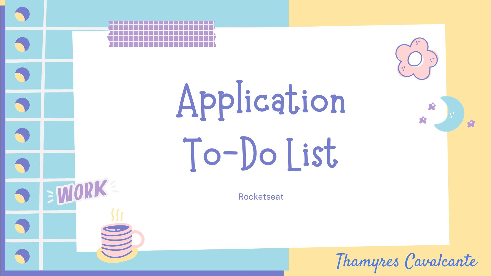

# Projeto TO DO LIST

 

  <a href="#-tecnologias">Tecnologias</a>&nbsp;&nbsp;&nbsp;|&nbsp;&nbsp;&nbsp;  
  <a href="#-projeto">Projeto</a>&nbsp;&nbsp;&nbsp;|&nbsp;&nbsp;&nbsp;  
  <a href="#-gif">Gif</a>&nbsp;&nbsp;&nbsp;&nbsp;&nbsp;&nbsp;

 

## 🚀 Tecnologias

Esse projeto foi desenvolvido com as seguintes tecnologias:
- Java
- Spring Boot
- Maven
- Spring Data JPA
- Git e Github

## 💻 Projeto

Projeto de To-Do list desenvolvido em Java com Spring boot, junto com a galera da Rocketseat. Criação de CRUD, com estruturas de controle e injeção de dependência.

## 📁 Acesso ao projeto

É possível acessar o projeto através do [Link](https://github.com/Thamyresmya/Rocketseat-Aplicacao-To-Do-List)

Neste repositório você tem acesso a todo o material produzido no curso.

## 📚 Me siga nas redes sociais

- [Linkedin](https://www.linkedin.com/in/thamyrescavalcante/)
- [Instagran](https://www.instagram.com/thamyres__cavalcante/)

 

---

Feito com 💜 by Thamyres Cavalcante.

